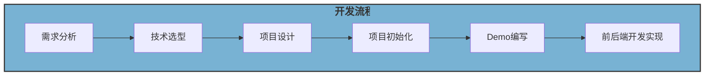

# 定制化代码生成项目

> 项目发布地址：https://github.com/LiangshouX/code-generator

## 项目介绍

基于React+ Spring Boot + Vert.x 响应式编程的 **定制化代码生成项目**。

* Stage 1 制作 **本地代码生成器**，一个基于 **基于命令行的脚手架**，能够根据用户的交互式输入快速生成特定代码。
* Stage2 开发 **制作代码生成器的工具**，比如有一段常用的项目代码，使用该工具。可以快速把项目代码制作为代码生成器，将是提高工作效率的大杀器
* Stage3 开发 **在线代码生成器平台**，可以在平台上制作发布自己的代码生成器，还可以在线使用别人的代码生成器，甚至可以共享协作。

## 项目背景（需求分析）

### 学习意义

1. 教程资料少
2. 新颖且亮眼
3. 能学到东西
4. 有区分度

### 解决的问题

1. 代码生成器本身就是自动生成常见、重复性的代码片段，解决**重复编码、效率低下**的问题
2. 网上的代码生成器都是别人封装好的，**无法满足实际开发的定制化需求**（比如要在每个类上增加特定的注解和注释），这也是为什么明明有代码生成器，很多开发者还是会抱怨自己的工作总是复制粘贴、编写重复的代码、天天 CRUD(增删改查)。如果能够有一个工具帮助开发者快速定制属于自己的代码生成器，那么将进一步提高开发效率。
3. 在团队开发中，要生成的代码可能是需要频繁变化和持续更新和维护的。如果有一个线上的平台来维护多个不同的代码生成器，支持在线编辑和共享生成器，在提高效率的同时，将有利于协作共建，打造更高质量的代码生成器。

### 实际应用

1. 经常做算法题的，可能需要一套Java ACM代码输入模版
2. 经常开发新项目的，可能需要一套初始化项目模板代码，比如一键生成Controller层代码（替换其中的对象），整合Redis、MySQL
3. 制作项目“换皮工具，支持一键给网络热门项目换皮”

## 调研

网络的代码生成器项目 e.g. 前端 Ant Design Pro中后台项目脚手架；后端 MyBatis X插件，能够让用户通过界面来创建CRUD重复代码。

## 技术选型

### 前端

| 技术           | 描述                           |
| -------------- | ------------------------------ |
| React 开发框架 | 前端开发框架                   |
| 组件库         | 前端组件库                     |
| 代码编辑器     | 用于代码编辑的工具             |
| 前端工程化     | ESLint + Prettier + TypeScript |

### 后端

| 技术                | 描述                           |
| ------------------- | ------------------------------ |
| Java Spring Boot    | 后端开发框架                   |
| MySQL               | 关系型数据库管理系统           |
| MyBatis Plus        | 数据持久化框架                 |
| Java 命令行应用开发 | 开发命令行应用的技术           |
| FreeMarker 模板引擎 | 用于生成动态内容的模板引擎     |
| Vert.x 响应式编程   | 响应式编程框架                 |
| Caffeine + Redis    | 多级缓存解决方案               |
| 分布式任务调度系统  | 处理分布式任务的系统           |
| 多种设计模式        | 在应用程序设计中使用的设计模式 |
| 多种系统设计的巧思  | 在系统设计中的创新想法和方法   |
| 对象存储            | 存储和管理对象数据的解决方案   |

### 学习重点

Java 命令行应用开发、FreeMarker 模板引擎、Vert.x 响应式编程、设计模式、系统设计的巧思、分布式任务调度系统都是本项目的学习重点，也是校招简历上很少有同学提到的知识实践，学完后能够大大增加简历的区分度!

> Web Framework Benchmarks 性能对比网站：
>
> https://www.techempower.com/benchmarks/#section=data-r21&test=composite

## 项目设计

### 核心原理

> 一句话：参数 + 模板文件 = 生成的完整的代码

将参数注入到这套模板生成其他代码，只需要改变参数即可得到完整的代码。

### Stage 1—本地代码生成器

#### 业务流程

1) 准备用于制作代码生成器的原始代码(比如Java ACM 模板项目)，用于后续生成
2) 开发者基于原始代码，设置参数、编写动态模板
3) 制作可交互的命令行工具，支持用户输入参数，得到代码生成器jar 包
4) 使用者得到代码生成器jar 包，执行程序并输入参数，从而生成完整代码

#### 实现思路

1) 先根据本地项目，扫描文件树，实现同样的静态代码生成
2) 根据本地的项目，预设部分动态参数、编写模板文件，能够传入配置对象进行生成
3) 制作可交互的命令行工具，接受用户输入的参数，并动态生成代码
4) 封装制作代码生成器jar 包文件，并简化使用命令

#### 关键问题

* 如何根据一套项目文件，完整的生成同样一套项目
* 如何编写动态模板文件？怎么根据模板和参数生成代码
* 如何制作命令行工具？
* 怎么将命令行制作为jar包？怎么简化使用命令？

### Stage 2—代码生成器制作工具

这个阶段，我们的目标是做一个本地的代码生成器制作工具，能够快速将一个项目制作为可以动态定制部分内容的代码生成器。并且以一个 Spring Boot 初始化项目模板(Maven 项目)为例，演示如何根据自己的需要动态生成Java后端初始化项目。

#### 业务流程
1) 准备用于制作代码生成器的原始代码(比如 Spring Boot 项目模板)，用于后续生成
2) 开发者基于原始代码，使用代码生成器制作工具，来快速设置参数、生成动态模板
3) 使用代码生成器制作工具，动态生成代码生成器iar 包
4) 使用者得到代码生成器jar 包，执行程序并输入参数，从而生成完整代码

相比第一阶段的业务流程，本阶段完成后，可以直接使用代码生成器制作工具来快速将固定的项目代码改造为可定制生成的动态模板，并自动生成命令行工具iar 包。

#### 实现思路

1) 使用独立空间来存储管理要生成的原始文件、动态模板文件等
2) 使用配置文件来记录要生成的参数和模板文件信息、自定义配置等 元信息
3) 代生成器制作工具需要有多种可单独或组合使用的功能，比如从原始文件中抽取参数、动态生成命令行工具、打jar包等

#### 关键问题

1) 如何使用配置文件来记录参数和模板文件信息?何种结构?
2) 怎么能够提高代码生成器的制作效率?工具应该提供哪些能力?
3) 如何从原始文件中抽取参数?有哪些类的参数?有哪些抽取规则?比如布尔类型参数(是否生成)、字符串类型参数(生成指定的值)等

### Stage 3—在线代码生成器平台

经过前两个阶段，我们已经能够使用本地的代码生成器制作工具来快速定制自己的代码生成器了。但如果我们想和团队其他同学共同维护代码生成器、或者使用其他人的代码生成器，通过本地文件互传的方式肯定就很麻烦了。
所以本阶段我们要打造一个在线代码生成器平台，可以理解为代码生成器的 应用市场。所有人都能发布、使用甚至是在线制作自己的代码生成器!::本阶段我们的终极目标是，在平台上制作和发布项目“换皮” 工具，帮助小伙伴们一键给网络热门项目换皮!

#### 业务流程

1) 获取用于制作代码生成器的原始代码(手动准备或者远程拉取代码)
2) 开发者基于原始代码，使用在线代码生成器制作工具，来快速制作代码生成器
3) 开发者发布代码生成器至平台
4) 使用者在平台上搜索代码生成器，支持在线使用或者下载离线jar包（进阶：支持API调用）

#### 实现思路

1) 使用Web开发框架实现代码生成器信息的增删改查
2) 将本地的配置和文件 上云，存储到数据库、对象存储等云服务。
3) 通过可视化界面来操作第二阶段的代码生成器制作工具，复用阶段二的成果

#### 关键问题

1. 怎么在云上存储管理代码生成器?
2. 如何通过前端开发，提高代码生成器的制作效率?
3. 如何通过后端优化，提高代码生成器的制作性能?
4. 如何保证代码生成器的存储空间不超限、如何优化存储?

## 作业&复盘

1) 理解代码生成器项目三个阶段的区别，从中学习到拆解项目的思路和方法

   阶段一：本地的脚手架工具

   阶段二：生成工具的工具

   阶段三：上线成为平台，多人协作，共同维护

   

2) 尝试自己做项目时，像鱼皮本篇教程一样编写一个项目设计方案

   好的

   

3) 思考上述关键问题的实现方案，欢迎大家交流讨论

   蹲

   

4) 在GitHub 新建仓库(或者 fork 鱼皮的代码仓)，为下期项目开发做准备

   > https://github.com/LiangshouX/code-generator

